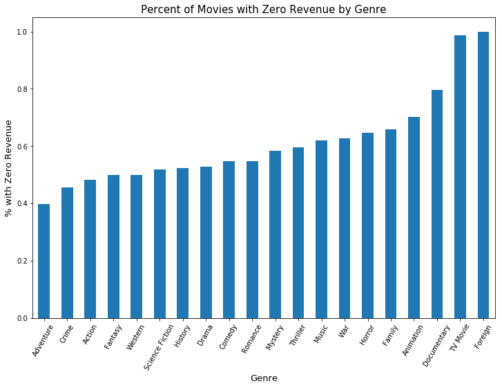

# TMDb movie data analysis

## Table of Contents
<ul>
<li><a href="#intro">Introduction</a></li>
<li><a href="#wrangling">Data Wrangling</a></li>
<li><a href="#eda">Exploratory Data Analysis</a></li>
<li><a href="#conclusions">Conclusions</a></li>
</ul>

<a id='intro'></a>
## Introduction

> In the following report, I analyzed movie data I obtained from TMDb via Kaggle. I performed data wrangling and cleaning of the data, before proceeding to perform my analysis.


```python
import numpy as np
import pandas as pd
import matplotlib.pyplot as plt
import seaborn as sns
from matplotlib.colors import ListedColormap
% matplotlib inline
```

<a id='wrangling'></a>
## Data Wrangling


```python
# Importing the data into a dataframe for analysis
df = pd.read_csv('tmdb-movies.csv')

# Seeing what the first few rows of data look like to gain an understanding of the data
df.head()
```


<div>
<table border="1" class="dataframe">
  <thead>
    <tr style="text-align: right;">
      <th></th>
      <th>id</th>
      <th>imdb_id</th>
      <th>popularity</th>
      <th>budget</th>
      <th>revenue</th>
      <th>original_title</th>
      <th>cast</th>
      <th>homepage</th>
      <th>director</th>
      <th>tagline</th>
      <th>...</th>
      <th>overview</th>
      <th>runtime</th>
      <th>genres</th>
      <th>production_companies</th>
      <th>release_date</th>
      <th>vote_count</th>
      <th>vote_average</th>
      <th>release_year</th>
      <th>budget_adj</th>
      <th>revenue_adj</th>
    </tr>
  </thead>
  <tbody>
    <tr>
      <th>0</th>
      <td>135397</td>
      <td>tt0369610</td>
      <td>32.985763</td>
      <td>150000000</td>
      <td>1513528810</td>
      <td>Jurassic World</td>
      <td>Chris Pratt|Bryce Dallas Howard|Irrfan Khan|Vi...</td>
      <td>http://www.jurassicworld.com/</td>
      <td>Colin Trevorrow</td>
      <td>The park is open.</td>
      <td>...</td>
      <td>Twenty-two years after the events of Jurassic ...</td>
      <td>124</td>
      <td>Action|Adventure|Science Fiction|Thriller</td>
      <td>Universal Studios|Amblin Entertainment|Legenda...</td>
      <td>6/9/15</td>
      <td>5562</td>
      <td>6.5</td>
      <td>2015</td>
      <td>1.379999e+08</td>
      <td>1.392446e+09</td>
    </tr>
    <tr>
      <th>1</th>
      <td>76341</td>
      <td>tt1392190</td>
      <td>28.419936</td>
      <td>150000000</td>
      <td>378436354</td>
      <td>Mad Max: Fury Road</td>
      <td>Tom Hardy|Charlize Theron|Hugh Keays-Byrne|Nic...</td>
      <td>http://www.madmaxmovie.com/</td>
      <td>George Miller</td>
      <td>What a Lovely Day.</td>
      <td>...</td>
      <td>An apocalyptic story set in the furthest reach...</td>
      <td>120</td>
      <td>Action|Adventure|Science Fiction|Thriller</td>
      <td>Village Roadshow Pictures|Kennedy Miller Produ...</td>
      <td>5/13/15</td>
      <td>6185</td>
      <td>7.1</td>
      <td>2015</td>
      <td>1.379999e+08</td>
      <td>3.481613e+08</td>
    </tr>
    <tr>
      <th>2</th>
      <td>262500</td>
      <td>tt2908446</td>
      <td>13.112507</td>
      <td>110000000</td>
      <td>295238201</td>
      <td>Insurgent</td>
      <td>Shailene Woodley|Theo James|Kate Winslet|Ansel...</td>
      <td>http://www.thedivergentseries.movie/#insurgent</td>
      <td>Robert Schwentke</td>
      <td>One Choice Can Destroy You</td>
      <td>...</td>
      <td>Beatrice Prior must confront her inner demons ...</td>
      <td>119</td>
      <td>Adventure|Science Fiction|Thriller</td>
      <td>Summit Entertainment|Mandeville Films|Red Wago...</td>
      <td>3/18/15</td>
      <td>2480</td>
      <td>6.3</td>
      <td>2015</td>
      <td>1.012000e+08</td>
      <td>2.716190e+08</td>
    </tr>
    <tr>
      <th>3</th>
      <td>140607</td>
      <td>tt2488496</td>
      <td>11.173104</td>
      <td>200000000</td>
      <td>2068178225</td>
      <td>Star Wars: The Force Awakens</td>
      <td>Harrison Ford|Mark Hamill|Carrie Fisher|Adam D...</td>
      <td>http://www.starwars.com/films/star-wars-episod...</td>
      <td>J.J. Abrams</td>
      <td>Every generation has a story.</td>
      <td>...</td>
      <td>Thirty years after defeating the Galactic Empi...</td>
      <td>136</td>
      <td>Action|Adventure|Science Fiction|Fantasy</td>
      <td>Lucasfilm|Truenorth Productions|Bad Robot</td>
      <td>12/15/15</td>
      <td>5292</td>
      <td>7.5</td>
      <td>2015</td>
      <td>1.839999e+08</td>
      <td>1.902723e+09</td>
    </tr>
    <tr>
      <th>4</th>
      <td>168259</td>
      <td>tt2820852</td>
      <td>9.335014</td>
      <td>190000000</td>
      <td>1506249360</td>
      <td>Furious 7</td>
      <td>Vin Diesel|Paul Walker|Jason Statham|Michelle ...</td>
      <td>http://www.furious7.com/</td>
      <td>James Wan</td>
      <td>Vengeance Hits Home</td>
      <td>...</td>
      <td>Deckard Shaw seeks revenge against Dominic Tor...</td>
      <td>137</td>
      <td>Action|Crime|Thriller</td>
      <td>Universal Pictures|Original Film|Media Rights ...</td>
      <td>4/1/15</td>
      <td>2947</td>
      <td>7.3</td>
      <td>2015</td>
      <td>1.747999e+08</td>
      <td>1.385749e+09</td>
    </tr>
  </tbody>
</table>
<p>5 rows × 21 columns</p>
</div>


```python
# Looking at the dimensions of the data
df.shape
```


    (10866, 21)


```python
# Getting descriptive statistics for all the data columns and checking for negative values
df.describe()
```


<div>
<table border="1" class="dataframe">
  <thead>
    <tr style="text-align: right;">
      <th></th>
      <th>id</th>
      <th>popularity</th>
      <th>budget</th>
      <th>revenue</th>
      <th>runtime</th>
      <th>vote_count</th>
      <th>vote_average</th>
      <th>release_year</th>
      <th>budget_adj</th>
      <th>revenue_adj</th>
    </tr>
  </thead>
  <tbody>
    <tr>
      <th>count</th>
      <td>10866.000000</td>
      <td>10866.000000</td>
      <td>1.086600e+04</td>
      <td>1.086600e+04</td>
      <td>10866.000000</td>
      <td>10866.000000</td>
      <td>10866.000000</td>
      <td>10866.000000</td>
      <td>1.086600e+04</td>
      <td>1.086600e+04</td>
    </tr>
    <tr>
      <th>mean</th>
      <td>66064.177434</td>
      <td>0.646441</td>
      <td>1.462570e+07</td>
      <td>3.982332e+07</td>
      <td>102.070863</td>
      <td>217.389748</td>
      <td>5.974922</td>
      <td>2001.322658</td>
      <td>1.755104e+07</td>
      <td>5.136436e+07</td>
    </tr>
    <tr>
      <th>std</th>
      <td>92130.136561</td>
      <td>1.000185</td>
      <td>3.091321e+07</td>
      <td>1.170035e+08</td>
      <td>31.381405</td>
      <td>575.619058</td>
      <td>0.935142</td>
      <td>12.812941</td>
      <td>3.430616e+07</td>
      <td>1.446325e+08</td>
    </tr>
    <tr>
      <th>min</th>
      <td>5.000000</td>
      <td>0.000065</td>
      <td>0.000000e+00</td>
      <td>0.000000e+00</td>
      <td>0.000000</td>
      <td>10.000000</td>
      <td>1.500000</td>
      <td>1960.000000</td>
      <td>0.000000e+00</td>
      <td>0.000000e+00</td>
    </tr>
    <tr>
      <th>25%</th>
      <td>10596.250000</td>
      <td>0.207583</td>
      <td>0.000000e+00</td>
      <td>0.000000e+00</td>
      <td>90.000000</td>
      <td>17.000000</td>
      <td>5.400000</td>
      <td>1995.000000</td>
      <td>0.000000e+00</td>
      <td>0.000000e+00</td>
    </tr>
    <tr>
      <th>50%</th>
      <td>20669.000000</td>
      <td>0.383856</td>
      <td>0.000000e+00</td>
      <td>0.000000e+00</td>
      <td>99.000000</td>
      <td>38.000000</td>
      <td>6.000000</td>
      <td>2006.000000</td>
      <td>0.000000e+00</td>
      <td>0.000000e+00</td>
    </tr>
    <tr>
      <th>75%</th>
      <td>75610.000000</td>
      <td>0.713817</td>
      <td>1.500000e+07</td>
      <td>2.400000e+07</td>
      <td>111.000000</td>
      <td>145.750000</td>
      <td>6.600000</td>
      <td>2011.000000</td>
      <td>2.085325e+07</td>
      <td>3.369710e+07</td>
    </tr>
    <tr>
      <th>max</th>
      <td>417859.000000</td>
      <td>32.985763</td>
      <td>4.250000e+08</td>
      <td>2.781506e+09</td>
      <td>900.000000</td>
      <td>9767.000000</td>
      <td>9.200000</td>
      <td>2015.000000</td>
      <td>4.250000e+08</td>
      <td>2.827124e+09</td>
    </tr>
  </tbody>
</table>
</div>


```python
# Checking for additional information on the data, such as number of null values
df.info()
```

    <class 'pandas.core.frame.DataFrame'>
    RangeIndex: 10866 entries, 0 to 10865
    Data columns (total 21 columns):
    id                      10866 non-null int64
    imdb_id                 10856 non-null object
    popularity              10866 non-null float64
    budget                  10866 non-null int64
    revenue                 10866 non-null int64
    original_title          10866 non-null object
    cast                    10790 non-null object
    homepage                2936 non-null object
    director                10822 non-null object
    tagline                 8042 non-null object
    keywords                9373 non-null object
    overview                10862 non-null object
    runtime                 10866 non-null int64
    genres                  10843 non-null object
    production_companies    9836 non-null object
    release_date            10866 non-null object
    vote_count              10866 non-null int64
    vote_average            10866 non-null float64
    release_year            10866 non-null int64
    budget_adj              10866 non-null float64
    revenue_adj             10866 non-null float64
    dtypes: float64(4), int64(6), object(11)
    memory usage: 1.7+ MB
    

> I used the previous cells to obtain a basic understanding of the dataset as is. While doing so, I noticed that there were a high number of columns. Since our analysis will only focus on around 3 variables, I proceeded to drop the columns that I probably wouldn't be using in my analysis, to make it easier to work with.


```python
# Dropping columns that won't be used in the analysis
df.drop(['id', 'imdb_id', 'popularity', 'budget', 'revenue', 'cast', 'homepage', 'director', 'tagline', 'keywords', 'overview', 'production_companies', 'release_date', 'vote_count'], axis=1, inplace=True)
```


```python
df.head()
```


<div>
<table border="1" class="dataframe">
  <thead>
    <tr style="text-align: right;">
      <th></th>
      <th>original_title</th>
      <th>runtime</th>
      <th>genres</th>
      <th>vote_average</th>
      <th>release_year</th>
      <th>budget_adj</th>
      <th>revenue_adj</th>
    </tr>
  </thead>
  <tbody>
    <tr>
      <th>0</th>
      <td>Jurassic World</td>
      <td>124</td>
      <td>Action|Adventure|Science Fiction|Thriller</td>
      <td>6.5</td>
      <td>2015</td>
      <td>1.379999e+08</td>
      <td>1.392446e+09</td>
    </tr>
    <tr>
      <th>1</th>
      <td>Mad Max: Fury Road</td>
      <td>120</td>
      <td>Action|Adventure|Science Fiction|Thriller</td>
      <td>7.1</td>
      <td>2015</td>
      <td>1.379999e+08</td>
      <td>3.481613e+08</td>
    </tr>
    <tr>
      <th>2</th>
      <td>Insurgent</td>
      <td>119</td>
      <td>Adventure|Science Fiction|Thriller</td>
      <td>6.3</td>
      <td>2015</td>
      <td>1.012000e+08</td>
      <td>2.716190e+08</td>
    </tr>
    <tr>
      <th>3</th>
      <td>Star Wars: The Force Awakens</td>
      <td>136</td>
      <td>Action|Adventure|Science Fiction|Fantasy</td>
      <td>7.5</td>
      <td>2015</td>
      <td>1.839999e+08</td>
      <td>1.902723e+09</td>
    </tr>
    <tr>
      <th>4</th>
      <td>Furious 7</td>
      <td>137</td>
      <td>Action|Crime|Thriller</td>
      <td>7.3</td>
      <td>2015</td>
      <td>1.747999e+08</td>
      <td>1.385749e+09</td>
    </tr>
  </tbody>
</table>
</div>


> Additionally, I noticed that there were a high number of genres listed for most movies. After doing some more research online, I found out that TMDb lists the film's main genre first. Due to this, I decided to keep only the first genre in each list, in order to simplify the data exploration phase and questioning.


```python
# Retaining only the first genre in the genre column
df['main_genre'] = df['genres'].str.split('|').str[0]
df.drop(['genres'], axis=1, inplace=True)
df.head()
```


<div>
<table border="1" class="dataframe">
  <thead>
    <tr style="text-align: right;">
      <th></th>
      <th>original_title</th>
      <th>runtime</th>
      <th>vote_average</th>
      <th>release_year</th>
      <th>budget_adj</th>
      <th>revenue_adj</th>
      <th>main_genre</th>
    </tr>
  </thead>
  <tbody>
    <tr>
      <th>0</th>
      <td>Jurassic World</td>
      <td>124</td>
      <td>6.5</td>
      <td>2015</td>
      <td>1.379999e+08</td>
      <td>1.392446e+09</td>
      <td>Action</td>
    </tr>
    <tr>
      <th>1</th>
      <td>Mad Max: Fury Road</td>
      <td>120</td>
      <td>7.1</td>
      <td>2015</td>
      <td>1.379999e+08</td>
      <td>3.481613e+08</td>
      <td>Action</td>
    </tr>
    <tr>
      <th>2</th>
      <td>Insurgent</td>
      <td>119</td>
      <td>6.3</td>
      <td>2015</td>
      <td>1.012000e+08</td>
      <td>2.716190e+08</td>
      <td>Adventure</td>
    </tr>
    <tr>
      <th>3</th>
      <td>Star Wars: The Force Awakens</td>
      <td>136</td>
      <td>7.5</td>
      <td>2015</td>
      <td>1.839999e+08</td>
      <td>1.902723e+09</td>
      <td>Action</td>
    </tr>
    <tr>
      <th>4</th>
      <td>Furious 7</td>
      <td>137</td>
      <td>7.3</td>
      <td>2015</td>
      <td>1.747999e+08</td>
      <td>1.385749e+09</td>
      <td>Action</td>
    </tr>
  </tbody>
</table>
</div>


```python
# Visualing rough distribution of overall data
df.hist(figsize=(10,8));
```


> As you can see in the above graphs, the **"Budget"**, **"Revenue"**, and **"Runtime"** appear to be skewed right, while the **"Release Year"** seems to be skewed left. The **"Vote Average"** appears to be normally distributed.

### Data Cleaning (Replace this with more specific notes!)

> Since the column headers were already all in lower case with no spaces, no data cleaning needed to be done concerning that. I did however check for null values.


```python
# Checking for null values
df.info()
```

    <class 'pandas.core.frame.DataFrame'>
    RangeIndex: 10866 entries, 0 to 10865
    Data columns (total 7 columns):
    original_title    10866 non-null object
    runtime           10866 non-null int64
    vote_average      10866 non-null float64
    release_year      10866 non-null int64
    budget_adj        10866 non-null float64
    revenue_adj       10866 non-null float64
    main_genre        10843 non-null object
    dtypes: float64(3), int64(2), object(2)
    memory usage: 594.3+ KB
    


```python
# Displaying the 'genres' null rows to see if there are any major movies
df[df.main_genre.isnull()]
```


<div>
<table border="1" class="dataframe">
  <thead>
    <tr style="text-align: right;">
      <th></th>
      <th>original_title</th>
      <th>runtime</th>
      <th>vote_average</th>
      <th>release_year</th>
      <th>budget_adj</th>
      <th>revenue_adj</th>
      <th>main_genre</th>
    </tr>
  </thead>
  <tbody>
    <tr>
      <th>424</th>
      <td>Belli di papÃ</td>
      <td>100</td>
      <td>6.1</td>
      <td>2015</td>
      <td>0.00000</td>
      <td>0.0</td>
      <td>NaN</td>
    </tr>
    <tr>
      <th>620</th>
      <td>All Hallows' Eve 2</td>
      <td>90</td>
      <td>5.0</td>
      <td>2015</td>
      <td>0.00000</td>
      <td>0.0</td>
      <td>NaN</td>
    </tr>
    <tr>
      <th>997</th>
      <td>Star Wars Rebels: Spark of Rebellion</td>
      <td>44</td>
      <td>6.8</td>
      <td>2014</td>
      <td>0.00000</td>
      <td>0.0</td>
      <td>NaN</td>
    </tr>
    <tr>
      <th>1712</th>
      <td>Prayers for Bobby</td>
      <td>88</td>
      <td>7.4</td>
      <td>2009</td>
      <td>0.00000</td>
      <td>0.0</td>
      <td>NaN</td>
    </tr>
    <tr>
      <th>1897</th>
      <td>Jonas Brothers: The Concert Experience</td>
      <td>76</td>
      <td>7.0</td>
      <td>2009</td>
      <td>0.00000</td>
      <td>0.0</td>
      <td>NaN</td>
    </tr>
    <tr>
      <th>2370</th>
      <td>Freshman Father</td>
      <td>0</td>
      <td>5.8</td>
      <td>2010</td>
      <td>0.00000</td>
      <td>0.0</td>
      <td>NaN</td>
    </tr>
    <tr>
      <th>2376</th>
      <td>Doctor Who: A Christmas Carol</td>
      <td>62</td>
      <td>7.7</td>
      <td>2010</td>
      <td>0.00000</td>
      <td>0.0</td>
      <td>NaN</td>
    </tr>
    <tr>
      <th>2853</th>
      <td>Vizontele</td>
      <td>110</td>
      <td>7.2</td>
      <td>2001</td>
      <td>0.00000</td>
      <td>0.0</td>
      <td>NaN</td>
    </tr>
    <tr>
      <th>3279</th>
      <td>아기와 나</td>
      <td>96</td>
      <td>6.1</td>
      <td>2008</td>
      <td>0.00000</td>
      <td>0.0</td>
      <td>NaN</td>
    </tr>
    <tr>
      <th>4547</th>
      <td>London 2012 Olympic Opening Ceremony: Isles of...</td>
      <td>220</td>
      <td>8.3</td>
      <td>2012</td>
      <td>0.00000</td>
      <td>0.0</td>
      <td>NaN</td>
    </tr>
    <tr>
      <th>4732</th>
      <td>The Scapegoat</td>
      <td>100</td>
      <td>6.2</td>
      <td>2012</td>
      <td>0.00000</td>
      <td>0.0</td>
      <td>NaN</td>
    </tr>
    <tr>
      <th>4797</th>
      <td>Doctor Who: The Snowmen</td>
      <td>60</td>
      <td>7.8</td>
      <td>2012</td>
      <td>0.00000</td>
      <td>0.0</td>
      <td>NaN</td>
    </tr>
    <tr>
      <th>4890</th>
      <td>Cousin Ben Troop Screening</td>
      <td>2</td>
      <td>7.0</td>
      <td>2012</td>
      <td>0.00000</td>
      <td>0.0</td>
      <td>NaN</td>
    </tr>
    <tr>
      <th>5830</th>
      <td>Doctor Who: The Time of the Doctor</td>
      <td>60</td>
      <td>8.5</td>
      <td>2013</td>
      <td>0.00000</td>
      <td>0.0</td>
      <td>NaN</td>
    </tr>
    <tr>
      <th>5934</th>
      <td>Prada: Candy</td>
      <td>3</td>
      <td>6.9</td>
      <td>2013</td>
      <td>0.00000</td>
      <td>0.0</td>
      <td>NaN</td>
    </tr>
    <tr>
      <th>6043</th>
      <td>Bombay Talkies</td>
      <td>127</td>
      <td>5.9</td>
      <td>2013</td>
      <td>0.00000</td>
      <td>0.0</td>
      <td>NaN</td>
    </tr>
    <tr>
      <th>6530</th>
      <td>Saw Rebirth</td>
      <td>6</td>
      <td>5.9</td>
      <td>2005</td>
      <td>0.00000</td>
      <td>0.0</td>
      <td>NaN</td>
    </tr>
    <tr>
      <th>8234</th>
      <td>Viaggi di nozze</td>
      <td>103</td>
      <td>6.7</td>
      <td>1995</td>
      <td>0.00000</td>
      <td>0.0</td>
      <td>NaN</td>
    </tr>
    <tr>
      <th>8614</th>
      <td>T2 3-D: Battle Across Time</td>
      <td>12</td>
      <td>6.7</td>
      <td>1996</td>
      <td>0.00000</td>
      <td>0.0</td>
      <td>NaN</td>
    </tr>
    <tr>
      <th>8878</th>
      <td>Mom's Got a Date With a Vampire</td>
      <td>85</td>
      <td>5.4</td>
      <td>2000</td>
      <td>0.00000</td>
      <td>0.0</td>
      <td>NaN</td>
    </tr>
    <tr>
      <th>9307</th>
      <td>Goldeneye</td>
      <td>105</td>
      <td>5.3</td>
      <td>1989</td>
      <td>0.00000</td>
      <td>0.0</td>
      <td>NaN</td>
    </tr>
    <tr>
      <th>9799</th>
      <td>The Amputee</td>
      <td>5</td>
      <td>5.0</td>
      <td>1974</td>
      <td>0.00000</td>
      <td>0.0</td>
      <td>NaN</td>
    </tr>
    <tr>
      <th>10659</th>
      <td>The Party at Kitty and Stud's</td>
      <td>71</td>
      <td>3.0</td>
      <td>1970</td>
      <td>28081.84172</td>
      <td>0.0</td>
      <td>NaN</td>
    </tr>
  </tbody>
</table>
</div>


```python
# Since rows with null genre values appear to be missing important information while also seeming to be insignificant
# (~0.2%), dropping those rows
df.dropna(inplace=True);
df.info()
```

    <class 'pandas.core.frame.DataFrame'>
    Int64Index: 10843 entries, 0 to 10865
    Data columns (total 7 columns):
    original_title    10843 non-null object
    runtime           10843 non-null int64
    vote_average      10843 non-null float64
    release_year      10843 non-null int64
    budget_adj        10843 non-null float64
    revenue_adj       10843 non-null float64
    main_genre        10843 non-null object
    dtypes: float64(3), int64(2), object(2)
    memory usage: 677.7+ KB
    

> After checking for null values, it appeared that the genre column had a seemingly insignificant number of null values **(23)** out of the total number of rows **(10866)**. Additionally, other numbers necessary to conduct my analysis, such **revenue_adj**, seemed to be missing from those rows. Because of this, I decided to drop them.


```python
# Gaining idea of what data looks like after cleaning
df.head()
```


<div>
<table border="1" class="dataframe">
  <thead>
    <tr style="text-align: right;">
      <th></th>
      <th>original_title</th>
      <th>runtime</th>
      <th>vote_average</th>
      <th>release_year</th>
      <th>budget_adj</th>
      <th>revenue_adj</th>
      <th>main_genre</th>
    </tr>
  </thead>
  <tbody>
    <tr>
      <th>0</th>
      <td>Jurassic World</td>
      <td>124</td>
      <td>6.5</td>
      <td>2015</td>
      <td>1.379999e+08</td>
      <td>1.392446e+09</td>
      <td>Action</td>
    </tr>
    <tr>
      <th>1</th>
      <td>Mad Max: Fury Road</td>
      <td>120</td>
      <td>7.1</td>
      <td>2015</td>
      <td>1.379999e+08</td>
      <td>3.481613e+08</td>
      <td>Action</td>
    </tr>
    <tr>
      <th>2</th>
      <td>Insurgent</td>
      <td>119</td>
      <td>6.3</td>
      <td>2015</td>
      <td>1.012000e+08</td>
      <td>2.716190e+08</td>
      <td>Adventure</td>
    </tr>
    <tr>
      <th>3</th>
      <td>Star Wars: The Force Awakens</td>
      <td>136</td>
      <td>7.5</td>
      <td>2015</td>
      <td>1.839999e+08</td>
      <td>1.902723e+09</td>
      <td>Action</td>
    </tr>
    <tr>
      <th>4</th>
      <td>Furious 7</td>
      <td>137</td>
      <td>7.3</td>
      <td>2015</td>
      <td>1.747999e+08</td>
      <td>1.385749e+09</td>
      <td>Action</td>
    </tr>
  </tbody>
</table>
</div>


<a id='eda'></a>
## Exploratory Data Analysis

In this section, I proceeded to investigate specific questions about the data.

### 1) Does genre type impact revenue?


```python
# Creating a dataframe copy to use for this question's analysis in case of any data wrangling I may need to do
df2 = df.copy()
df2.head()
```


<div>
<table border="1" class="dataframe">
  <thead>
    <tr style="text-align: right;">
      <th></th>
      <th>original_title</th>
      <th>runtime</th>
      <th>vote_average</th>
      <th>release_year</th>
      <th>budget_adj</th>
      <th>revenue_adj</th>
      <th>main_genre</th>
    </tr>
  </thead>
  <tbody>
    <tr>
      <th>0</th>
      <td>Jurassic World</td>
      <td>124</td>
      <td>6.5</td>
      <td>2015</td>
      <td>1.379999e+08</td>
      <td>1.392446e+09</td>
      <td>Action</td>
    </tr>
    <tr>
      <th>1</th>
      <td>Mad Max: Fury Road</td>
      <td>120</td>
      <td>7.1</td>
      <td>2015</td>
      <td>1.379999e+08</td>
      <td>3.481613e+08</td>
      <td>Action</td>
    </tr>
    <tr>
      <th>2</th>
      <td>Insurgent</td>
      <td>119</td>
      <td>6.3</td>
      <td>2015</td>
      <td>1.012000e+08</td>
      <td>2.716190e+08</td>
      <td>Adventure</td>
    </tr>
    <tr>
      <th>3</th>
      <td>Star Wars: The Force Awakens</td>
      <td>136</td>
      <td>7.5</td>
      <td>2015</td>
      <td>1.839999e+08</td>
      <td>1.902723e+09</td>
      <td>Action</td>
    </tr>
    <tr>
      <th>4</th>
      <td>Furious 7</td>
      <td>137</td>
      <td>7.3</td>
      <td>2015</td>
      <td>1.747999e+08</td>
      <td>1.385749e+09</td>
      <td>Action</td>
    </tr>
  </tbody>
</table>
</div>


```python
# Checking dataframe info to confirm it's consistent with the original's
df2.info()
```

    <class 'pandas.core.frame.DataFrame'>
    Int64Index: 10843 entries, 0 to 10865
    Data columns (total 7 columns):
    original_title    10843 non-null object
    runtime           10843 non-null int64
    vote_average      10843 non-null float64
    release_year      10843 non-null int64
    budget_adj        10843 non-null float64
    revenue_adj       10843 non-null float64
    main_genre        10843 non-null object
    dtypes: float64(3), int64(2), object(2)
    memory usage: 677.7+ KB
    


```python
# Checking for any non-null zero values in our dependent variable (revenue_adj).
df2[(df2['revenue_adj'] == 0)].count()
```


    original_title    5993
    runtime           5993
    vote_average      5993
    release_year      5993
    budget_adj        5993
    revenue_adj       5993
    main_genre        5993
    dtype: int64


> Though I had already checked for null values across the data, I thought it would be pertinent to check for other data quality issues specific to this question, such as zero values in the revenue column. Though technically non-null, I worked under the assumption that a value of zero would be an error, considering these were all released movies. Additionally, I had already checked in the **Data Wrangling** section that there were no negative values. As you can see from the results above, there were quite a large number of zero values in the revenue column, which would drastically affect our results. As such, I decided to drop them from our dataset, but not before seeing how including them would skew our results.


```python
# Obtaining mean revenue statistics for the genre columnm before dropping zero revenue values
df2.groupby('main_genre')['revenue_adj'].mean()
```


    main_genre
    Action             7.401006e+07
    Adventure          1.665356e+08
    Animation          7.671443e+07
    Comedy             3.837766e+07
    Crime              4.674641e+07
    Documentary        2.150125e+06
    Drama              3.578622e+07
    Family             7.724863e+07
    Fantasy            8.283760e+07
    Foreign            0.000000e+00
    History            6.536195e+07
    Horror             2.417979e+07
    Music              3.807907e+07
    Mystery            3.002289e+07
    Romance            4.721514e+07
    Science Fiction    9.951810e+07
    TV Movie           7.485782e+05
    Thriller           3.096924e+07
    War                4.874310e+07
    Western            4.730739e+07
    Name: revenue_adj, dtype: float64


```python
# Generating a plot of the above data (includes rows w/ zero revenue values)
my_cmap = ListedColormap(sns.color_palette()[0])
genre_list = df2.groupby('main_genre')['revenue_adj'].mean()
genre_list.sort_values().plot(kind='bar', figsize=(12,8), colormap=my_cmap)
plt.title('Average Revenue by Genre', fontsize=15)
plt.xlabel('Genre', fontsize=13)
plt.xticks(rotation=60)
plt.ylabel('Average Revenue (USD 100 mil)', fontsize=13);
```


> I proceeded to generate the above data and graph to just gain a visual idea of how the zero revenue values affected the final outcome. From the above chart, it appeared that the **'Adventure'** genre seemed to significantly make the most revenue on average, far exceeding almost every other genre by at least double. Such a large difference for just one genre is not what I would expect. Additionally, the **'Foreign'** film category had an average revenue of zero, which also goes against my initial expectation that all genres would generate at least some revenue when averaged out. I then proceeded to re-run my analysis, but without the movies with zero revenue.


```python
# Retaining only rows without non-null zero values in the dependent variable column
df2 = df2[df2.revenue_adj != 0]
```

> Since the large number of zero values **(55.27%)** drastically affected our results (as seem in the chart above), I decided to drop them.


```python
# Re-checking for non-null zero values in the dependent variable column
df2[(df2['revenue_adj'] == 0)].count()
```


    original_title    0
    runtime           0
    vote_average      0
    release_year      0
    budget_adj        0
    revenue_adj       0
    main_genre        0
    dtype: int64


```python
# Re-obtaining count data after dropping rows
df2.info()
```

    <class 'pandas.core.frame.DataFrame'>
    Int64Index: 4850 entries, 0 to 10848
    Data columns (total 7 columns):
    original_title    4850 non-null object
    runtime           4850 non-null int64
    vote_average      4850 non-null float64
    release_year      4850 non-null int64
    budget_adj        4850 non-null float64
    revenue_adj       4850 non-null float64
    main_genre        4850 non-null object
    dtypes: float64(3), int64(2), object(2)
    memory usage: 303.1+ KB
    


```python
# Re-obtaining mean revenue statistics for the genre column after fixing the data
df2.groupby('main_genre')['revenue_adj'].mean()
```


    main_genre
    Action             1.426376e+08
    Adventure          2.764585e+08
    Animation          2.576326e+08
    Comedy             8.475980e+07
    Crime              8.604049e+07
    Documentary        1.055516e+07
    Drama              7.587174e+07
    Family             2.270164e+08
    Fantasy            1.656752e+08
    History            1.369488e+08
    Horror             6.828551e+07
    Music              1.002081e+08
    Mystery            7.217042e+07
    Romance            1.045478e+08
    Science Fiction    2.067658e+08
    TV Movie           5.838910e+07
    Thriller           7.641153e+07
    War                1.307201e+08
    Western            9.461478e+07
    Name: revenue_adj, dtype: float64


```python
# Re-generating a plot
my_cmap = ListedColormap(sns.color_palette()[0])
genre_list = df2.groupby('main_genre')['revenue_adj'].mean()
genre_list.sort_values().plot(kind='bar', figsize=(12,8), colormap=my_cmap)
plt.title('Average Revenue by Genre', fontsize=15)
plt.xlabel('Genre', fontsize=13)
plt.xticks(rotation=60)
plt.ylabel('Average Revenue (USD 100 mil)', fontsize=13);
```


> After re-running the numbers with the movies with zero revenue dropped, the chart above is more in-line with what I originally thought would be the case, with **'Adventure'** and **'Animation'** genres being near the top, and **'Documentaries'** being at the bottom, with no drastic differences between those at the top and no movie genres generating zero revenue. It should be noted, however, that the **'Foreign'** film genre was completely removed due to this.

> In addition to the above, I also wanted to delve deeper into the movies with zero revenue, to see if anything strange popped up. First, I created a new dataframe and a new column in the dataframe that would label rows where the revenue was zero.


```python
# Creating new dataframe to manipulate
df_rev = df.copy()
```


```python
# Creating function to label rows that have zero revenue
def f(row):
    if row['revenue_adj'] == 0:
        val = 1
    else:
        val = 0
    return val
```


```python
# Creating new column to house zero revenue labels
df_rev['zero_rev'] = df_rev.apply(f, axis=1)
```


```python
df_rev.head()
```


<div>
<table border="1" class="dataframe">
  <thead>
    <tr style="text-align: right;">
      <th></th>
      <th>original_title</th>
      <th>runtime</th>
      <th>vote_average</th>
      <th>release_year</th>
      <th>budget_adj</th>
      <th>revenue_adj</th>
      <th>main_genre</th>
      <th>zero_rev</th>
    </tr>
  </thead>
  <tbody>
    <tr>
      <th>0</th>
      <td>Jurassic World</td>
      <td>124</td>
      <td>6.5</td>
      <td>2015</td>
      <td>1.379999e+08</td>
      <td>1.392446e+09</td>
      <td>Action</td>
      <td>0</td>
    </tr>
    <tr>
      <th>1</th>
      <td>Mad Max: Fury Road</td>
      <td>120</td>
      <td>7.1</td>
      <td>2015</td>
      <td>1.379999e+08</td>
      <td>3.481613e+08</td>
      <td>Action</td>
      <td>0</td>
    </tr>
    <tr>
      <th>2</th>
      <td>Insurgent</td>
      <td>119</td>
      <td>6.3</td>
      <td>2015</td>
      <td>1.012000e+08</td>
      <td>2.716190e+08</td>
      <td>Adventure</td>
      <td>0</td>
    </tr>
    <tr>
      <th>3</th>
      <td>Star Wars: The Force Awakens</td>
      <td>136</td>
      <td>7.5</td>
      <td>2015</td>
      <td>1.839999e+08</td>
      <td>1.902723e+09</td>
      <td>Action</td>
      <td>0</td>
    </tr>
    <tr>
      <th>4</th>
      <td>Furious 7</td>
      <td>137</td>
      <td>7.3</td>
      <td>2015</td>
      <td>1.747999e+08</td>
      <td>1.385749e+09</td>
      <td>Action</td>
      <td>0</td>
    </tr>
  </tbody>
</table>
</div>


> I then wanted to see if there were any genres that were more likely to have zero revenue listed. I did this by generating a percentage of movies with zero revenue for each genre, with genres being closer to **'1'** having more zero revenue movies.


```python
# Generating percentage of movies that have zero revenue for each genre
df_rev.groupby('main_genre')['zero_rev'].mean().sort_values()
```


    main_genre
    Adventure          0.397611
    Crime              0.456693
    Action             0.481132
    Fantasy            0.500000
    Western            0.500000
    Science Fiction    0.518692
    History            0.522727
    Drama              0.528333
    Comedy             0.547219
    Romance            0.548387
    Mystery            0.584000
    Thriller           0.594705
    Music              0.620000
    War                0.627119
    Horror             0.645902
    Family             0.659722
    Animation          0.702233
    Documentary        0.796296
    TV Movie           0.987179
    Foreign            1.000000
    Name: zero_rev, dtype: float64


```python
# Creating chart to visually see if there are any genres that have significantly more zero revenues on average
my_cmap = ListedColormap(sns.color_palette()[0])
df_rev.groupby('main_genre')['zero_rev'].mean().sort_values().plot(kind='bar', figsize=(12,8), colormap=my_cmap)
plt.title('Percent of Movies with Zero Revenue by Genre', fontsize=15)
plt.xlabel('Genre', fontsize=13)
plt.xticks(rotation=60)
plt.ylabel('% with Zero Revenue', fontsize=13);
```





> As you can see from the chart above, there don't seem to be any real outliers, though a number of movie genres are much more likely than not to report zero revenue. Specifically, the **'TV Movies'** and **'Foreign'** genres almost exclusively report zero revenues. This may be due to them being relatively unknown movies with smaller revenues/audiences, though this can't be said for certain.

### 2) Does movie rating impact revenue?


```python
# Creating a dataframe copy to use for this question's analysis in case of any data wrangling I may need to do.
# Retaining only rows where revenue was not zero
df2 = df[df.revenue_adj != 0].copy()
```


```python
# Checking dataframe info to confirm it's consistent with the original's
df2.info()
```

    <class 'pandas.core.frame.DataFrame'>
    Int64Index: 4850 entries, 0 to 10848
    Data columns (total 7 columns):
    original_title    4850 non-null object
    runtime           4850 non-null int64
    vote_average      4850 non-null float64
    release_year      4850 non-null int64
    budget_adj        4850 non-null float64
    revenue_adj       4850 non-null float64
    main_genre        4850 non-null object
    dtypes: float64(3), int64(2), object(2)
    memory usage: 303.1+ KB
    


```python
# Checking movies with vote averages of zero
df2.query('vote_average == 0.0')
```


<div>
<table border="1" class="dataframe">
  <thead>
    <tr style="text-align: right;">
      <th></th>
      <th>original_title</th>
      <th>runtime</th>
      <th>vote_average</th>
      <th>release_year</th>
      <th>budget_adj</th>
      <th>revenue_adj</th>
      <th>main_genre</th>
    </tr>
  </thead>
  <tbody>
  </tbody>
</table>
</div>


> Since we found out that there were a large number of movies with zero revenue in the previous section, I decided to drop those movies for this section as well, since I'm still working under the assumption that those released movies reported zero revenue due to data quality issues rather than actually earning zero revenue. Additionally, I checked for movies with vote averages of zero for the same reason. Since there were none, I feel confident with moving forward with the analysis.


```python
# Plotting the relationship between movie ratings and revenue
df2.plot(x='vote_average', y='revenue_adj', kind='scatter', figsize=(15,8));
plt.title('Average Revenue vs. Vote Average', fontsize=15)
plt.xlabel('Vote Average', fontsize=13)
plt.ylabel('Average Revenue (USD 1 billion)', fontsize=13);
```


> Looking at the chart above, it appears that there may be a weak to moderate positive correlation between **'vote_average'** and **'revenue'**. As a movie is better rated, it will generally also have better revenue on average, though it shouldn't be taken as a rule of thumb.

### 3) Is there a correlation between runtime and movie rating?


```python
# Creating a dataframe copy to use for this question's analysis in case of any data wrangling I may need to do
df2 = df.copy()
```


```python
# Checking dataframe info to confirm it's consistent with the original's
df2.info()
```

    <class 'pandas.core.frame.DataFrame'>
    Int64Index: 10843 entries, 0 to 10865
    Data columns (total 7 columns):
    original_title    10843 non-null object
    runtime           10843 non-null int64
    vote_average      10843 non-null float64
    release_year      10843 non-null int64
    budget_adj        10843 non-null float64
    revenue_adj       10843 non-null float64
    main_genre        10843 non-null object
    dtypes: float64(3), int64(2), object(2)
    memory usage: 677.7+ KB
    


```python
# Checking movies with vote averages of zero
df2.query('vote_average == 0.0')
```


<div>
<table border="1" class="dataframe">
  <thead>
    <tr style="text-align: right;">
      <th></th>
      <th>original_title</th>
      <th>runtime</th>
      <th>vote_average</th>
      <th>release_year</th>
      <th>budget_adj</th>
      <th>revenue_adj</th>
      <th>main_genre</th>
    </tr>
  </thead>
  <tbody>
  </tbody>
</table>
</div>


```python
# Checking movies with runtimes of zero
df2.query('runtime == 0.0')
```


<div>
<table border="1" class="dataframe">
  <thead>
    <tr style="text-align: right;">
      <th></th>
      <th>original_title</th>
      <th>runtime</th>
      <th>vote_average</th>
      <th>release_year</th>
      <th>budget_adj</th>
      <th>revenue_adj</th>
      <th>main_genre</th>
    </tr>
  </thead>
  <tbody>
    <tr>
      <th>92</th>
      <td>Mythica: The Necromancer</td>
      <td>0</td>
      <td>5.4</td>
      <td>2015</td>
      <td>0.000000e+00</td>
      <td>0.0</td>
      <td>Fantasy</td>
    </tr>
    <tr>
      <th>334</th>
      <td>Ronaldo</td>
      <td>0</td>
      <td>6.5</td>
      <td>2015</td>
      <td>0.000000e+00</td>
      <td>0.0</td>
      <td>Documentary</td>
    </tr>
    <tr>
      <th>410</th>
      <td>Anarchy Parlor</td>
      <td>0</td>
      <td>5.6</td>
      <td>2015</td>
      <td>0.000000e+00</td>
      <td>0.0</td>
      <td>Horror</td>
    </tr>
    <tr>
      <th>445</th>
      <td>The Exorcism of Molly Hartley</td>
      <td>0</td>
      <td>5.0</td>
      <td>2015</td>
      <td>0.000000e+00</td>
      <td>0.0</td>
      <td>Horror</td>
    </tr>
    <tr>
      <th>486</th>
      <td>If There Be Thorns</td>
      <td>0</td>
      <td>5.4</td>
      <td>2015</td>
      <td>0.000000e+00</td>
      <td>0.0</td>
      <td>TV Movie</td>
    </tr>
    <tr>
      <th>595</th>
      <td>Deep Dark</td>
      <td>0</td>
      <td>4.6</td>
      <td>2015</td>
      <td>0.000000e+00</td>
      <td>0.0</td>
      <td>Horror</td>
    </tr>
    <tr>
      <th>616</th>
      <td>The Outfield</td>
      <td>0</td>
      <td>6.6</td>
      <td>2015</td>
      <td>0.000000e+00</td>
      <td>0.0</td>
      <td>Drama</td>
    </tr>
    <tr>
      <th>1241</th>
      <td>Dance-Off</td>
      <td>0</td>
      <td>5.7</td>
      <td>2014</td>
      <td>0.000000e+00</td>
      <td>0.0</td>
      <td>Romance</td>
    </tr>
    <tr>
      <th>1289</th>
      <td>Treehouse</td>
      <td>0</td>
      <td>3.4</td>
      <td>2014</td>
      <td>2.993546e+06</td>
      <td>0.0</td>
      <td>Thriller</td>
    </tr>
    <tr>
      <th>1293</th>
      <td>Tim Maia</td>
      <td>0</td>
      <td>6.0</td>
      <td>2014</td>
      <td>0.000000e+00</td>
      <td>0.0</td>
      <td>Documentary</td>
    </tr>
    <tr>
      <th>1849</th>
      <td>Spectacular!</td>
      <td>0</td>
      <td>5.2</td>
      <td>2009</td>
      <td>0.000000e+00</td>
      <td>0.0</td>
      <td>Drama</td>
    </tr>
    <tr>
      <th>2315</th>
      <td>Listen to Your Heart</td>
      <td>0</td>
      <td>7.3</td>
      <td>2010</td>
      <td>0.000000e+00</td>
      <td>0.0</td>
      <td>Drama</td>
    </tr>
    <tr>
      <th>3329</th>
      <td>Grande, grosso e Verdone</td>
      <td>0</td>
      <td>5.3</td>
      <td>2008</td>
      <td>0.000000e+00</td>
      <td>0.0</td>
      <td>Family</td>
    </tr>
    <tr>
      <th>3794</th>
      <td>Toi, moi, les autres</td>
      <td>0</td>
      <td>5.2</td>
      <td>2011</td>
      <td>0.000000e+00</td>
      <td>0.0</td>
      <td>Music</td>
    </tr>
    <tr>
      <th>3857</th>
      <td>Cell 213</td>
      <td>0</td>
      <td>5.2</td>
      <td>2011</td>
      <td>0.000000e+00</td>
      <td>0.0</td>
      <td>Horror</td>
    </tr>
    <tr>
      <th>3884</th>
      <td>eCupid</td>
      <td>0</td>
      <td>4.6</td>
      <td>2011</td>
      <td>0.000000e+00</td>
      <td>0.0</td>
      <td>Romance</td>
    </tr>
    <tr>
      <th>4063</th>
      <td>Madea's Family Reunion</td>
      <td>0</td>
      <td>5.9</td>
      <td>2002</td>
      <td>7.273568e+06</td>
      <td>0.0</td>
      <td>Comedy</td>
    </tr>
    <tr>
      <th>4138</th>
      <td>A Time for Dancing</td>
      <td>0</td>
      <td>7.5</td>
      <td>2002</td>
      <td>0.000000e+00</td>
      <td>0.0</td>
      <td>Drama</td>
    </tr>
    <tr>
      <th>4829</th>
      <td>Rags</td>
      <td>0</td>
      <td>5.7</td>
      <td>2012</td>
      <td>0.000000e+00</td>
      <td>0.0</td>
      <td>TV Movie</td>
    </tr>
    <tr>
      <th>4944</th>
      <td>How to Fall in Love</td>
      <td>0</td>
      <td>4.7</td>
      <td>2012</td>
      <td>0.000000e+00</td>
      <td>0.0</td>
      <td>Comedy</td>
    </tr>
    <tr>
      <th>5216</th>
      <td>Madea's Class Reunion</td>
      <td>0</td>
      <td>6.9</td>
      <td>2003</td>
      <td>0.000000e+00</td>
      <td>0.0</td>
      <td>Comedy</td>
    </tr>
    <tr>
      <th>5695</th>
      <td>Skinwalker Ranch</td>
      <td>0</td>
      <td>4.3</td>
      <td>2013</td>
      <td>0.000000e+00</td>
      <td>0.0</td>
      <td>Thriller</td>
    </tr>
    <tr>
      <th>5920</th>
      <td>The Food Guide to Love</td>
      <td>0</td>
      <td>5.6</td>
      <td>2013</td>
      <td>0.000000e+00</td>
      <td>0.0</td>
      <td>Romance</td>
    </tr>
    <tr>
      <th>5938</th>
      <td>Go Goa Gone</td>
      <td>0</td>
      <td>5.3</td>
      <td>2013</td>
      <td>0.000000e+00</td>
      <td>0.0</td>
      <td>Comedy</td>
    </tr>
    <tr>
      <th>5992</th>
      <td>Amiche da morire</td>
      <td>0</td>
      <td>5.5</td>
      <td>2013</td>
      <td>0.000000e+00</td>
      <td>0.0</td>
      <td>Romance</td>
    </tr>
    <tr>
      <th>6040</th>
      <td>The Vatican Exorcisms</td>
      <td>0</td>
      <td>4.7</td>
      <td>2013</td>
      <td>0.000000e+00</td>
      <td>0.0</td>
      <td>Horror</td>
    </tr>
    <tr>
      <th>6383</th>
      <td>The 12 Dogs of Christmas</td>
      <td>0</td>
      <td>4.7</td>
      <td>2005</td>
      <td>2.233127e+06</td>
      <td>0.0</td>
      <td>Drama</td>
    </tr>
    <tr>
      <th>6552</th>
      <td>Quatre étoiles</td>
      <td>0</td>
      <td>5.9</td>
      <td>2005</td>
      <td>0.000000e+00</td>
      <td>0.0</td>
      <td>Comedy</td>
    </tr>
    <tr>
      <th>6934</th>
      <td>Jean-Philippe</td>
      <td>0</td>
      <td>5.6</td>
      <td>2006</td>
      <td>0.000000e+00</td>
      <td>0.0</td>
      <td>Comedy</td>
    </tr>
    <tr>
      <th>8874</th>
      <td>Mission Kashmir</td>
      <td>0</td>
      <td>5.7</td>
      <td>2000</td>
      <td>0.000000e+00</td>
      <td>0.0</td>
      <td>Action</td>
    </tr>
  </tbody>
</table>
</div>


> Per the results above, it appeared that there were a relatively small number of movies with a listed runtime of zero minutes. Working under the assumption that these were instances of data quality issues, I proceeded to remove these from our working dataset.


```python
# Retaining only the movies without a runtime of zero minutes
df2 = df2[df.runtime != 0]
```


```python
# Re-checking movies with runtimes of zero
df2.query('runtime == 0.0')
```


<div>
<table border="1" class="dataframe">
  <thead>
    <tr style="text-align: right;">
      <th></th>
      <th>original_title</th>
      <th>runtime</th>
      <th>vote_average</th>
      <th>release_year</th>
      <th>budget_adj</th>
      <th>revenue_adj</th>
      <th>main_genre</th>
    </tr>
  </thead>
  <tbody>
  </tbody>
</table>
</div>


```python
df2.info()
```

    <class 'pandas.core.frame.DataFrame'>
    Int64Index: 10813 entries, 0 to 10865
    Data columns (total 7 columns):
    original_title    10813 non-null object
    runtime           10813 non-null int64
    vote_average      10813 non-null float64
    release_year      10813 non-null int64
    budget_adj        10813 non-null float64
    revenue_adj       10813 non-null float64
    main_genre        10813 non-null object
    dtypes: float64(3), int64(2), object(2)
    memory usage: 675.8+ KB
    

> Since there were no longer any movies with vote averages or runtimes of zero, I felt fairly confident with the quality of the data to proceed.


```python
# Plotting the relationship between runtime and movie ratings
df2.plot(x='runtime', y='vote_average', kind='scatter', figsize=(15,8))
plt.title('Vote Average vs. Runtime')
plt.xlabel('Runtime (minutes)')
plt.ylabel('Vote Average');
```


> Looking at the graph above, I visually determined that there might be outliers in terms of runtime. As such, I decided to run some statistics below to try to identify them.


```python
# Running summary statistics over the 'runtime' column
df2['runtime'].describe()
```


    count    10813.000000
    mean       102.420882
    std         30.870098
    min          2.000000
    25%         90.000000
    50%         99.000000
    75%        112.000000
    max        900.000000
    Name: runtime, dtype: float64


```python
# Generating the Interquartile Range (IQR) to identify potential outliers
Q1 = df2['runtime'].quantile(0.25)
Q3 = df2['runtime'].quantile(0.75)
IQR = Q3-Q1
print((Q1 - 1.5*IQR),(Q3 + 1.5*IQR)) # non-outlier range
```

    57.0 145.0
    


```python
# Retaining only rows within the non-outlier range
df2 = df2[(df2.runtime >= (Q1 - 1.5*IQR)) & (df2.runtime <= (Q3 + 1.5*IQR))]
```


```python
df2.info()
```

    <class 'pandas.core.frame.DataFrame'>
    Int64Index: 10142 entries, 0 to 10865
    Data columns (total 7 columns):
    original_title    10142 non-null object
    runtime           10142 non-null int64
    vote_average      10142 non-null float64
    release_year      10142 non-null int64
    budget_adj        10142 non-null float64
    revenue_adj       10142 non-null float64
    main_genre        10142 non-null object
    dtypes: float64(3), int64(2), object(2)
    memory usage: 633.9+ KB
    

> After identifying the outliers, I removed them from the dataset in order to have a better visual representation of the data, to better find a correlation.


```python
# Re-running summary statistics over the 'runtime' column
df2['runtime'].describe()
```


    count    10142.000000
    mean       101.023960
    std         15.058349
    min         57.000000
    25%         90.000000
    50%         99.000000
    75%        110.000000
    max        145.000000
    Name: runtime, dtype: float64


```python
# Plotting the relationship between runtime and movie ratings
df2.plot(x='runtime', y='vote_average', kind='scatter', figsize=(15,8))
plt.title('Vote Average vs. Runtime', fontsize=15)
plt.xlabel('Runtime (minutes)', fontsize=13)
plt.ylabel('Vote Average', fontsize=13);
```


> Looking at the chart above, it appears that there may be a weak to moderate positive correlation between **'runtime'** and **'vote_average'**. It appears that movies that are longer in length may also generally have better ratings. However, there may be other factors (lurking z variables) that explain this.

<a id='conclusions'></a>
## Conclusions

Based on the analysis, I've summarized my findings below:

> 1) It appears that **'Adventure'**, **'Animation'**, and **'Family'** movies generate the most revenue on average. However, due to data quality issues, I had to remove approximately half of the available data (**movies with zero revenue**). This, combined with the finding that some movie genres were much more likely to report zero revenue (most notable the **'Foreign'** and **'TV Movie'** genres), the results could be skewed. Additionally, I worked under the assumption that the main genre would be the most important. This has certain limitations as the other genre labels in tandem could potentially have more of an effect on the revenue than I realize.

> 2) Movies that are better rated also tend to have higher revenues on average. It should be noted however that there is only a weak to moderate correlation, as well as the fact that I had to drop approximately half of the available data due to the same data quality issue stated above.

> 3) Movies that have longer runtimes also tend to have better ratings on average. It should be noted however that there is only a weak to moderate correlation. However, unlike the other two findings above, most of the data points were able to be used.
